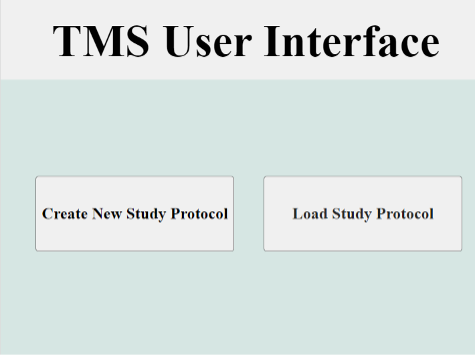

# EASY-TMS
**EASY-TMS** (Experiment Automator System for TMS) is a MATLAB GUI for automating complex stimulation sequences.
The GUI is built using MATLAB's app designer and interfaces with TMS devices using the [MAGIC toolbox](https://github.com/nigelrogasch/MAGIC) 

**Authors:**  
Danielle Lundtvedt, lundt011@umn.edu 
Aaron McInnes, mcinn125@umn.edu 

# EASY-TMS User Guide

The home screen, as shown below, has two different options. 

## Configuring a Protocol
### Option 1. Create New Study Protocol
If the Create New Study Protocol button is pressed. The Experimental Automator Panel will appear. Choose this option to create a new study protocol from scratch. The Experimental Automator Panel is the screen shown below. 

As seen above, there are a few options in the above screen. Below is a list of all the options.

1. Pulse Type: From the pulse type drop down single pulse, paired pulse, theta burst, or continuous pulses can be chosen. The appropriate parameters will appear in accordance with each pulse. Put in the values wanted.
2. Advanced Options: If the advanced options button is checked, the coil delay parameter option appears and can be included.
3. Add Next Automation Step: Adds the pulse with the current set parameters to the end of the protocol.
4. Step View: If this is changed, the view goes from a simplistic list view to a detailed table view. In table view, certain edits cannot be made.
5. Add New Grouping: Adds a new overarching group which contains the next pulses added. The pulses in this grouping can be randomized or blocked. 
6. Grouping Categorization: For each overarching group, the pulses can be blocked, run in the order put in, or randomized, run in a random order.
7. Add Step Above: Adds the current pulse above the selected step.
8. Delete Current Step: Deletes the step currently selected.
9. Duplicate Grouping: Allows an entire grouping of pulses to be duplicated and added to the end of the protocol.
10. File Name to Save Data: The name of the file to save to protocol to.
11. Save Current Automation to Excel: Saves the current protocol data to an excel sheet with the file name chosen. Saves to the folder the app data is saved within.
12. Home: The home button, which is on all screens, takes the app back to the initial home screen.

### Option 2. Load Study Protocol
The Load Study Protocol will lead to a pop-up screen. Choose this option to load a previously created protocol. The pop-up screen will have two options. The options are 2a. Edit Existing Protocol or 2b. Run Existing Protocol. 

#### Option 2a. Edit Existing Protocol
This option will lead you to an edit screen similar to the Experimental Automator Panel. A file selector will also appear to choose the file with the protocol you want to edit. The same options will be available as the automotor panel except the data will only be available in table view. Most data in the table can be edited by clicking the cell and typing as well. The updated protocol can be saved to the same file, or a copy can be created.

It is important to note that as shown below, when selecting the file, to choose all files to see excel files as well as MATLAB files. 

#### Option 2b. Run Existing Protocol
If the Run Existing Protocol is chosen, the first window that will appear is a guided connection page to connect to the TMS stimulator. 

1. Stimulator Type: The options for stimulator type are Magstim, Bistim, Rapid, and MagVenture.
2. Connection Port: Type in the port that the TMS stimulator is plugged into.
3. Unlock Code: If rapid is chosen, an Unlock Code option will appear to put the unlock code into.
4. Connection Status: Shows if the stimulator is connected or not.
5. Connect to Simulator: Connects the computer to the stimulator. If successful, the connection status will say connected before the next screen appears.

## Running a Protocol

The next screen that will appear is the Determine Motor Threshold screen. 

1. Stimulator Output: This is the stimulator output for the stimulator.
2. Arm: Arms the stimulator then switches to a fire button.
3. Fire: Fires the stimulator at the set stimulator output.
4. Number of Pulses at Current Intensity: Counts the number of pulses fired at the set stimulator output and resets to zero when the stimulator output is changed.
5. Number of MEPs: If an MEP occurred and the yes button was pressed, this would increase by one. It will reset to zero when the stimulator output is changed.

If Continue to Protocol is pressed, the next screen that will appear is the Participant Information page.

Here, participant information (i.e. demographics) can be entered. The motor threshold will be saved from the Determine Motor Threshold page. If the information is added to an existing file, it will be added in a new row. Otherwise, a new file can be made. 

The final page which appears if the load study protocol is pressed is the Run Screen. 

A file selector will appear for the protocol to be selected. The protocol will be loaded into the table. As well, the motor threshold can be typed in or it can be brought over from the Participant Information page. If Start Protocol is pressed, the protocol will run and the pulse counter will show the pulse number within the pulse block the protocol is on. The block will also be bolded within the table. 

When the window is closed, the computer will automatically disconnect from the stimulator. This will occur in any window after the protocol is connected as well as when the home button is pressed. 
